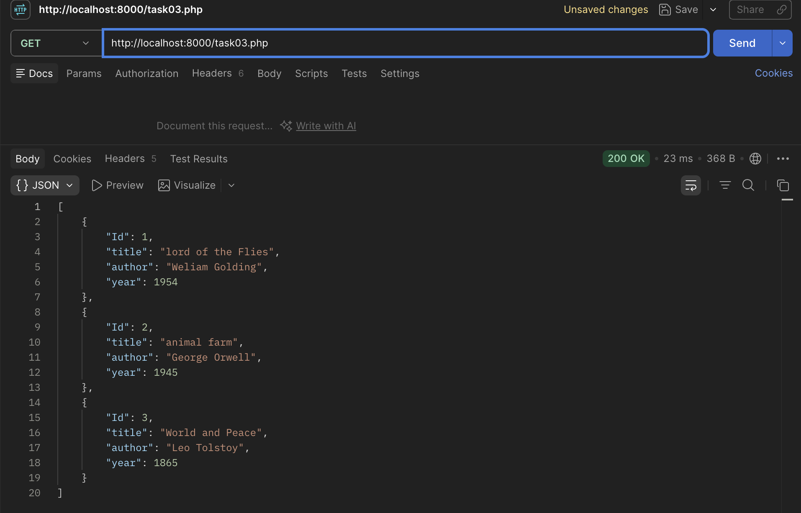

### HTTP methods

1) POST - creadtion of resourse
    client gives spec resource to server. server have to write this info with spec way
    curl -b "MacciSSID=..." -d "logout=1" http:/localhost/index.php

2) GET - read of recource
    client asks server spec resource, and gets answer
    curl -X GET -d "theme" http://localhost/frontend/components/theme/index.php

3) PUT - change of resource
    PUT: client asks to overwrite existing resource on server
    PATCH:  ... modifes existing resource on server

    curl -X PUT -d "title=new&time=9:00" http://localhost/data/id413

4) DELETE - deletion of resource
    client asks to delete spec resource on server

    curl -X DELETE Shttp://local/data/id413

### CODES

- 200 -- response if resolved
- 201 -- for ex. POST req was accepted and server side created some resources
- 400 -- bad request, server dont understand req syntaxis
- 404 -- not found
- 500 -- server side error, server dont know what to responde

